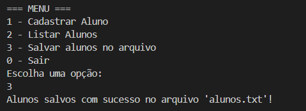

# 📘 Student Registration – Java Project

> 🇧🇷 Leia este conteúdo em [Português](./README-pt.md)  
> ⚠️ Note: The variable names and code comments are currently in Portuguese, as this project was initially developed for local learning purposes. An English version will be implemented in a future update.

---

## ⚙️ Features

### 1. Register Student
The user inputs:
- Name
- Age
- Grade

These details are stored in a list of `Aluno` objects.

### 2. List Students
Displays all students registered in the current session.

### 3. Save to File
Saves the student list into a `alunos.txt` file created at the project root.

Example output:
Name: João, Age: 14, Grade: 8.5  
Name: Maria, Age: 13, Grade: 9.0

### 4. Read Students from File *(optional)*
If implemented, it reads and displays the students saved in `alunos.txt`.

---

## 🧪 How to Use

1. Clone the repository:
```bash
git clone https://github.com/seu-usuario/seu-repo.git
```

2. Open the project in NetBeans or Visual Studio Code.

3. Run the class `CadastroAlunos`.

4. Use the interactive terminal menu:

```
=== MENU ===
1 - Register Student
2 - List Students
3 - Save students to file
0 - Exit
```

5. To view saved students:
   - Open the `alunos.txt` file located at the project root.
   - Or implement the `lerAlunosDoArquivo()` function to view them in the terminal.

---

## 🖼️ Terminal Execution Example



---

## 🛠️ Technologies

- Java 8+
- NetBeans or Visual Studio Code
- Git and GitHub for version control

---

## 🧠 Learnings

- Creating and using lists with `ArrayList`
- Using `Scanner` for terminal input
- Writing to files using `FileWriter` and best practices with `try-with-resources`
- Building terminal menus with `do-while` and `switch` structures

---

## 📝 Author

Developed by **Lucas Bravo Soares** as part of Java learning.  
Contributions are welcome!